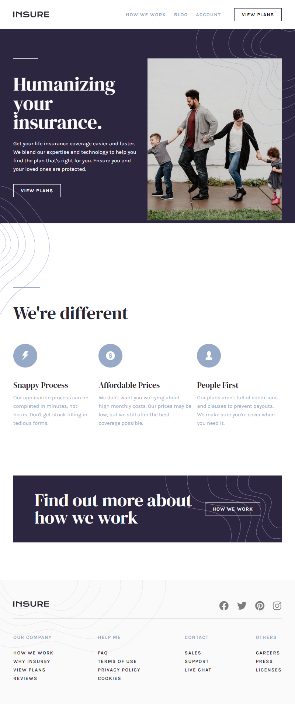

# Frontend Mentor - Insure landing page solution

This is a solution to the [Insure landing page challenge on Frontend Mentor](https://www.frontendmentor.io/challenges/insure-landing-page-uTU68JV8). Frontend Mentor challenges help you improve your coding skills by building realistic projects. 

## Table of contents

- [Frontend Mentor - Insure landing page solution](#frontend-mentor---insure-landing-page-solution)
  - [Table of contents](#table-of-contents)
  - [Overview](#overview)
    - [The challenge](#the-challenge)
    - [Screenshot](#screenshot)
    - [Links](#links)
  - [My process](#my-process)
    - [Built with](#built-with)
    - [What I learned](#what-i-learned)
    - [Continued development](#continued-development)
  - [Author](#author)


**Note: Delete this note and update the table of contents based on what sections you keep.**

## Overview

### The challenge

Users should be able to:

- View the optimal layout for the site depending on their device's screen size
- See hover states for all interactive elements on the page
- Navigate the nav bar in the mobile design

### Screenshot




### Links

- Solution URL: [Add solution URL here](https://your-solution-url.com)
- Live Site URL: [Add live site URL here](https://your-live-site-url.com)

## My process

### Built with

- Semantic HTML5 markup
- CSS custom properties
- Flexbox
- Vanilla Javascript
- [font DM serif](https://fonts.googleapis.com/css2?family=DM+Serif+Display&display=swap) - For font family
- [font Karla 400, 700](https://fonts.googleapis.com/css2?family=Karla:wght@400;700&display=swap) - For font family
- [font awesome icons](https://kit.fontawesome.com/d88dc75d7a.js) - for social link icons


### What I learned

I learned a lot of things during the process of this project.
- Using css :pseudoselectors
- Structuring html tags properly (using html5 semantics, and naming classes and ids properly), to have a clean html code that would be easier to style.


To see how you can add code snippets, see below:

```html
<nav id="mobile-nav" class="mobile-nav position-nav">
  <div class="container">
      <div class="logo">
          

          <div class="bttn btn-2">
              
          </div>
      </div>

      <div class="links">
          <ul>
              <li><a href="#">How we work</a></li>
              <li><a href="#">Blog</a></li>
              <li><a href="#">Account</a></li>
          </ul>
          <button class="bttn-2">View Plans</button>
      </div>
  </div>
</nav>
```

- This is the styling for the links: an animation happens on hover. A line moves beneath the links from the left to the right on hovering over the links, and the link color changes.

```css
a:hover{
    color: var(--link-hover-color);
}

a::after{
    content: '';
    position: absolute;
    bottom: 0;
    left: 0;
    right: 0;
    background-color: var(--link-hover-color);
    height: 2px;
    
    transform: scale(0);
    transform-origin: right;
    transition: transform 300ms cubic-bezier(0.07, 0.29, 1, 1);
}

a:hover::after{
    transform: scale(1);
    transform-origin: left;
}
```

### Continued development

I would want to continue developing complex, dynamic and responsive landing pages using some of the properties and styling of this project.
Structuring the HTML alone was a hassle, as well as incorporating some of the images on the landing page body.
I'm proud of this development, but i know i'd need to learn better technologies to make the process even swifter.


## Author

- Frontend Mentor - [@Trayshmhirk](https://www.frontendmentor.io/profile/Trayshmhirk)
- Twitter - [@TrayShmhirk01](https://www.twitter.com/TrayShmhirk01)

